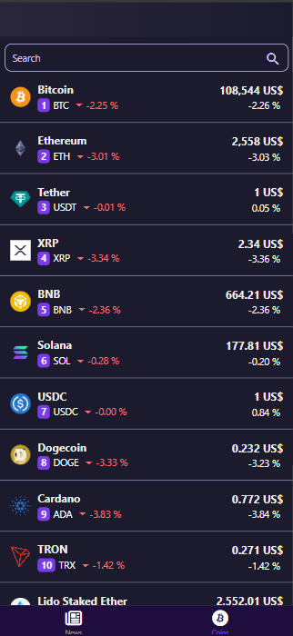
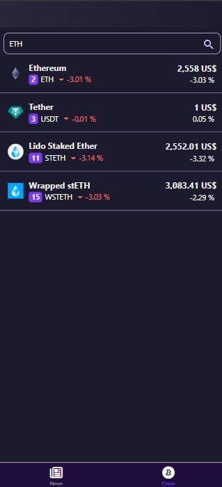

# Invictus App

Invictus es una aplicación móvil desarrollada en **React Native con Expo** que permite consultar información actualizada sobre criptomonedas y noticias del mercado financiero.

---

## 🚀 Características principales

- **Listado de Criptomonedas (Coins):**
  - Consulta precios, y datos clave de las principales criptomonedas.
  - Búsqueda instantánea por nombre o símbolo.
  - Actualización de datos mediante "pull to refresh".
  - Visualización clara de tendencias (subidas/bajadas) con iconos y colores.

- **Noticias Cripto (News):**
  - Acceso a las noticias del sector.
  - Enlaces directos a las fuentes originales.
  - Interfaz limpia y fácil de navegar.

---

## 📱 Capturas de pantalla

**Noticias Actualizadas del Mercado**

 

**Listado Dinámico de Criptomonedas**


 

**Funcionalidad de Búsqueda en Tiempo Real**


 

---

## 🛠️ Instalación y ejecución

1. **Clona el repositorio:**
   ```bash
   git clone https://github.com/tuusuario/invictus.git
   cd invictus
   ```

2. **Instala las dependencias:**
   ```bash
   npm install
   ```

3. **Inicia la aplicación:**
   ```bash
   npx expo start
   ```

4. **Escanea el QR con Expo Go** en tu dispositivo móvil o ejecuta en un emulador.

---

## 📂 Estructura del proyecto

```
/components
  Header.jsx
  Cards.jsx
/navigation
  Navigation.jsx
/screen
  Coins.jsx
  News.jsx
/App.js
```

---

## ⚙️ Tecnologías y dependencias principales

- [React Native](https://reactnative.dev/)
- [Expo](https://expo.dev/)
- [React Navigation](https://reactnavigation.org/)
- [react-native-vector-icons](https://github.com/oblador/react-native-vector-icons)
- [CoinGecko API](https://www.coingecko.com/) (para datos de monedas)
- [Alpha Vantage API](https://www.alphavantage.co/) (para noticias)

---

## 💡 Uso

- **Coins:**  
  Utiliza la pestaña de monedas para explorar y buscar criptomonedas. Filtra por nombre o símbolo y mantente actualizado con los precios en tiempo real.

- **News:**  
  Accede a la pestaña de noticias para informarte sobre los últimos acontecimientos del mercado. Haz clic en cualquier noticia para leerla completa en su fuente original.

---


## 👨‍💻 Autores

- **Juan Esteban Buritica Garcia** — Desarrollador Full Stack  
    [](https://github.com/esteban2502)  

    [](https://www.linkedin.com/in/juan-esteban-buritica-garcia-ab9505273/)

  

  🌐 [https://esteban2502.github.io/](https://esteban2502.github.io/estebanPortafolio.github.io/)

- **Andrew Loaiza Guzman** — Desarrollador Full Stack

    [](https://github.com/Andrew06G)  